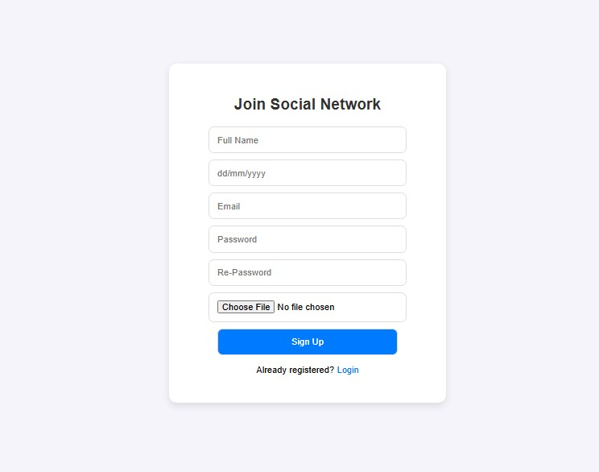
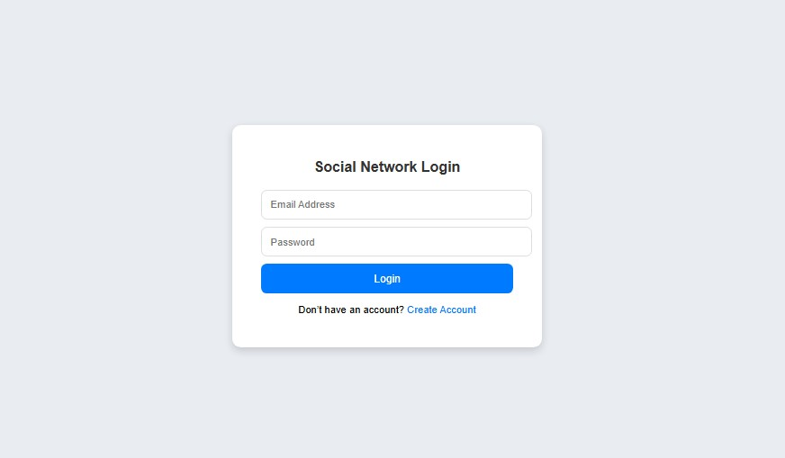
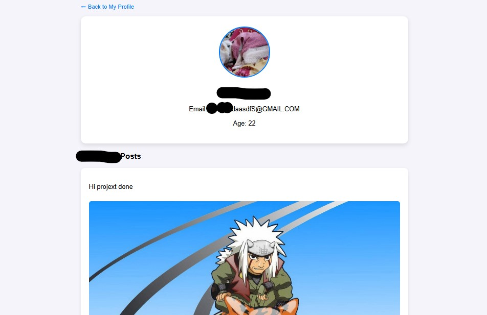
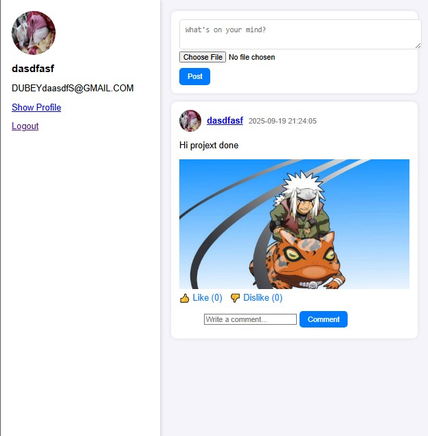

# 🧑‍🤝‍🧑 Social Network (PHP + MySQL)

A simple **social networking web application** built using **PHP, MySQL, and XAMPP**.  
It allows users to create accounts, log in, upload profile pictures, create posts, like/dislike posts, and comment on them.

---

## 🚀 Features
- ✅ User Registration (Sign Up) with profile picture upload  
- ✅ User Login & Authentication (session-based)  
- ✅ Profile page with user details (name, email, age, profile picture)  
- ✅ Add new posts with optional images  
- ✅ Like 👍 and Dislike 👎 functionality for posts  
- ✅ Comment system with threaded display  
- ✅ View other users' profiles and their posts  
- ✅ Responsive design with simple CSS  

---

## 🛠️ Tech Stack
- **Frontend**: HTML, CSS  
- **Backend**: PHP (PDO for database interaction)  
- **Database**: MySQL  
- **Server**: XAMPP (Apache + MySQL)  

---

## 🌐 Project Link
Local: [http://localhost/social_network/signup.php](http://localhost/social_network/signup.php)  

---

## 📸 Screenshots

### 📝 Signup Page

### 🔑 Login Page

### 👤 Profile Page

### 👥 Public Home View

---

## ⚙️ Installation & Setup (XAMPP)

1. Install [XAMPP](https://www.apachefriends.org/).  
2. Start **Apache** and **MySQL** from the XAMPP Control Panel.  
3. Copy this project folder into:  
"C:\xampp\htdocs\social_network"

4. Open **phpMyAdmin** at [http://localhost/phpmyadmin](http://localhost/phpmyadmin).  
5. Create a new database:  
CREATE DATABASE social_network;
6. Import the provided SQL file (social_network.sql) into this database.

7. Update includes/db.php if needed (database name, username, password).

---

## 👨‍💻 Author
**Shivam Kumar Dubey (kuro-shiv)**  

---
Made for **Webkul Project Assessment**

